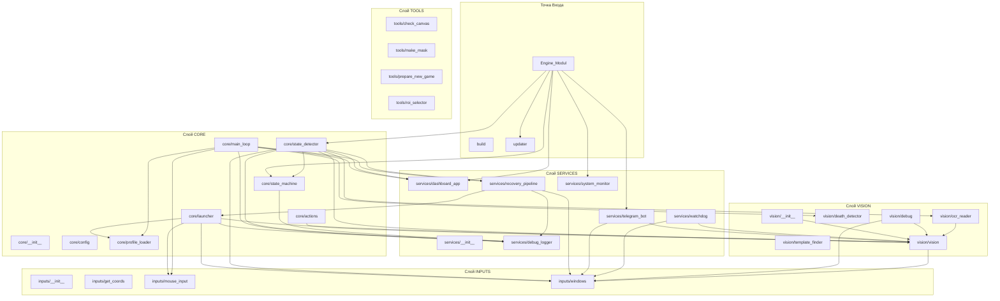

# Динамическая архитектурная карта CyberFarm Engine

## Назначение слоев
* **core/** — Управление конфигурациями, профилями и глобальным циклом.
* **vision/** — Компьютерное зрение, детекция состояний и OCR.
* **inputs/** — Эмуляция ввода и управление HWND окнами.
* **services/** — Фоновые сервисы, веб-панель и восстановления.
* **games/** — Конфиги и пресеты под конкретные игры.